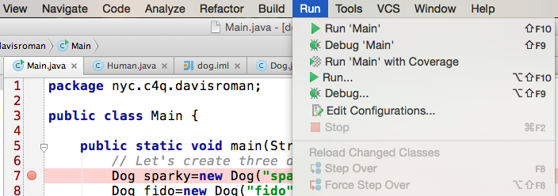
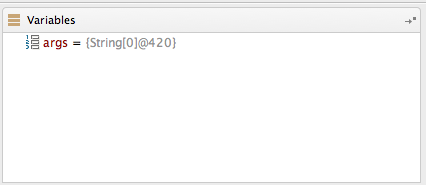
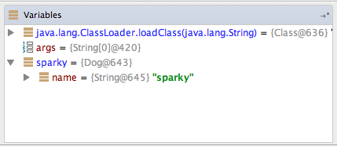
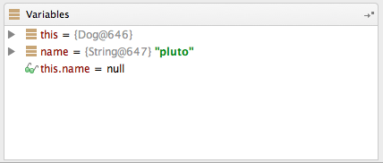
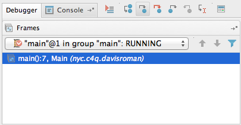
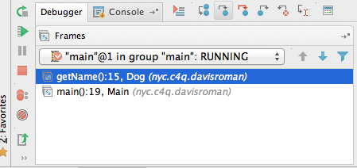
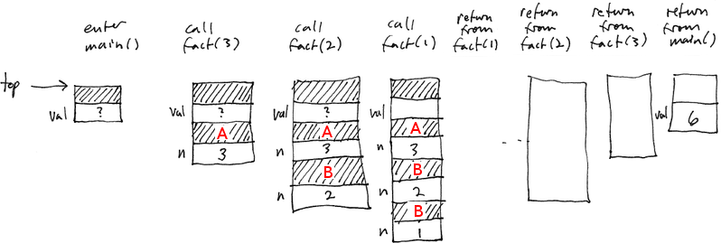
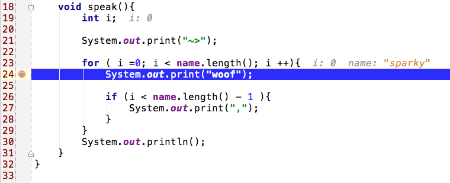
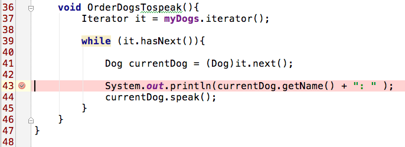

# The Intellij Debugging ( Not so Quick ) Quick Start Guide


## Introduction

Welcome! We're going to spend some time learning about the capabilities of the Intellij debugger. I'm confident that this will be time well spent so much so that future *you* will likely want to hop into a time machine propelled at 88mph, go back to today, and give you a pat on the back for sitting through this. 

Hey now! Then why didn't you just teach us this stuff on day one ?!

There's actually a very good reason for this. The role of the debugger is to amplify a programmer's debugging capabilties but certainly not to become a substitute for it.

The goal of any good programmer ( if you choose to accept it ) is to develop enough skill such that you're able to manually step through a program in order to figure out the flow and solve issues by yourself. Once you've reach this point of critical mass then by all means use the debugger as much as you want.

But remember, nothing can substitute good programmer intuition!

Ok, so I'll step off my soap box now and end my mini rant.

## Prerequisite: Scope and Lifetime of Variables
This concept is critical for making effective use of the debugger. At times, it will seem as if variables magically appear and disappear however I assure you that there is no misdirection involved and it simply boils down to understanding when variables come in and go out of scope.
So if the mouthwash is the only thing that initially came to mind then definately check out
[variable_scope](variable_scope.md)

## ERRORS
[ How errors make programmers feel ] ( img/compiler_why_you_hate_me.jpg)

No matter how smart or how careful you are, errors are your constant companion. With practice, you will get slightly better at not making errors, and much, much better at finding and correcting them.

There are three kinds of errors: 
- syntax errors
- runtime errors
- logic errors.

###Syntax errors

These are errors where the compiler finds something wrong with your program, and you can't even try to execute it. For example, you may have incorrect punctuation, or may be trying to use a variable that hasn't been declared.

Syntax errors are the easiest to find and correct. The compiler will tell you where it got into trouble, and its best guess as to what you did wrong. Usually the error is on the exact line indicated by the compiler, or the line just before it; however, if the problem is incorrectly nested braces, the actual error may be at the beginning of the nested block.

###Runtime errors

If there are no syntax errors, Java may detect an error while your program is running. You will get an error message telling you the kind of error, and a stack trace that tells not only where the error occurred, but also what other method or methods you were in. For example,
```java
Exception in thread "main" java.lang.NullPointerException
        at Car.placeInCity(Car.java:25)
        at City.<init>(City.java:38)
        at City.main(City.java:49)
```
This says that a NullPointerException was detected in the method placeCarInCity at line 25 in Car.java, which was called from the constructor for City at line 38 in City.java, which was called from the main() method at line 49 in City.java. Sometimes there will be additional lines describing methods in the Java system itself; you can ignore these.

Runtime errors are intermediate in difficulty. Java tells you where it discovered that your program had gone wrong, but you need to trace back from there to figure out where the problem originated.

###Logic errors

A logic error is when your program compiles and runs, but does the wrong thing. Java has no idea what your program is supposed to do, so it provides no additional information to help you find the error.

Ways to track down a logic error include:

- Think about what the program must have done in order to produce the results it did. This will lead you to where the error must have occurred.
- Put in print statements to help you figure out what the program is actually doing.
- Use a debugger to step through your program and watch what it does.

## Debugging

![ debugging ] (img/debugging.jpg)

In order to  help demonstrate various debugging features, an example project called "dogs and humans" is provided. 

[dogs and humans](https://github.com/davisRoman/dogsandhumans)

### Setting our first breakpoint

> *Definition:* A `breakpoint` is an intentional stopping or pausing place in a program, put in place for debugging purposes. It is also sometimes simply referred to as a pause. More generally, a breakpoint is a means of acquiring knowledge about a program during its execution. During the interruption, the programmer inspects the test environment to find out whether the program is functioning as expected. 

Once you open up your "dogs and humans" project, you should initially see something like this:
<br />
<br />


Let's create a breakpoint on the very first line of our program:
```java
Dog spark = new Dog("sparky");
```
You'll create a breakpoint by clicking to the very right of the line number. Once a red dot appears then a breakpoint has been created as shown below.
<br />
<br />

<br />
</br />
Once you've got your breakpoint then you're ready to proceed. 

### Fire up a debug session in IntelliJ
You've created a breakpoint at this point but you're technically not debugging yet. 
We have to run our application in a special debug mode in order to get the ability to single step through the code. 

You can do this by simply clicking on Run -> Debug


<br />
<br />
Alternatively, you can click on the bug icon on the lower left vertical bar to initiate a debug session.
<br />
<br />

<br />
<br />
Regardless of how which step you choose, you should now see the `Run` window as shown below. Go ahead and select `Main`.
<br />
<br />
![hit enter on main ] (img/hit_enter_on_main.png)

So this is what you should see as soon as you're in the debug session. Your breakpoint now turns blue. 

#### Note: A blue breakpoint signifies that it has NOT executed yet!


<br />
<br />
As we step through our code, the `Variables` window will become a very useful tool to help us understand which variables are presently in scope or in other words, which variables the debugger is currently aware of. This is what your `Variables` window should look like at this very point in time.
<br />
<br />

<br />
<br />
## Specific Debugging Features
### Step-over 
> *Definition:* The Step Over feature executes a line of code as a complete unit, and then steps to the next statement in the current method body. Therefore, the next statement displayed is the next statement in the current procedure regardless of whether the current statement is a call to another procedure or not.

So let's go ahead and click on the Step Over icon. You can either click on the `FUNCTION` key + F8 on your mac
or click on Run -> Step Over
<br />
<br />
![ step_over ] (img/step_over.png)
<br />
<br />
Or click on the icon with the two circles stacked on top of eachother as shown below.
<br />
<br />
![ step_over2 ] (img/step_over2.png)
<br />
<br />
So now we should see that our breakpoint has turned red indicating that the line just executed. If you look at the proceeding line, you'll notice that it has now turned blue indicating that it's the next line to be executed. Also notice the string "sparky : Dog@643" that just appeared next to our first line of code showing us the unique object id of our sparky object. This is the `inline debugging` feature of IntelliJ in action!
<br />
<br />

<br />
<br />
But hey now! Check out our `Variables` window. Do you notice anything different about it? It now shows us an object called sparky. If you click on its left arrow it will show us the contents of its private instance variable, name, that is currently set to sparky.  Do you also notice that it says "Dog@643"? 

This unique object identifier will become even more handy in the future.
<br />
<br />

<br />
<br />
So why don't we take another step shall we ? Remember we want to `step over`
<br />
<br />

<br />
<br />
You'll now notice that the execution of our program moved forward one line and the inline debugger went ahead and showed us the unique object identifier for the Dog object called fido which happens to be 'Dog@645'
<br />
<br />

<br />
Now our `Variables` window shows us two objects that we can inspect. Cool right?

Something you may also want to do is change the state of your objects in real-time.
As long as the variable is currently in scope, you can select sparky's instance variable, name, in the `Variables` window and right click on `Set Value`
<br />
![ sparky set value ] (img/sparky_set_value.png)

You can now change the name of the sparky object from "sparky" to "clifford"

![ change name of sparky to clifford ] ( img/change_name_of_sparky_to_clifford.png)

### Step-into
> *Definition* Almost identical to how the step-over feature works except that the difference is that if the statement is a call to a method, the next statement displayed is the first statement in the method.

So let's go ahead and click on the Step Into icon. You can either click on the `FUNCTION` key + F7 on your mac
or click on Run -> Step Into


<br />
<br />

<br />
<br />
- So look at that! We stepped into the implementation of the Dog contructor because we tried to create an instance of Dog. Does this make sense?( Get it? Stepped into? )
<br />
<br />
- Also pay special attention to the variables window which shows us that `name` equals `pluto`
because this was the value passed into our constructor 
<br />
<br />
- If you presently take a look at the `Varibles` window you'll notice that `this.name` is set to `null`

Can you figure out why ?
<br />
<br />
If you figured that it's simply because we haven't executed the next line of code that sets the name variable then you're right!
<br />
<br />
Remember, while in debug mode you're dictating when the cpu is allowed to take the next step. You really are in control!
<br />
So now let's take a few more steps in order to exit out of the constructor, go ahead and click on step over until you're out of the constructor and you should end up here.
<br />
<br />

<br />
<br />
At this point, take another step and you should end up here.
<br />
<br />

<br />
<br />
Great, now the pluto object has been created and the pluto variable contains a reference to the object `Dog@646`

## Frames ( aka Activation Records ) Window

<br />
- Your local variables are created inside what is called a frame (otherwise known as an activation record ) on a structure known as the stack where the most recently added object is the first one that is eligible to be removed. In real life, a stack can be thought of as a pile of plates. 
- As we add plates to the top of the pile, we begin to grow our pile in a last in, first out scheme. 


- We always remove the most recently add plate from the top of the pile until we reach the last plate that has been longest on the pile.
<br />
<br />
- These details will help you understand the `Frames` window shown above. It currently only contains a frame for the main() method because the debugger is currently sitting in this method. However, every time we jump into a new method, a new frame is added to the top of the pile. This technique allows the cpu to dive into as many methods as necessary and then easily be able to unwind the stack and get back to where it initially started.
<br />
<br />
But don't take my word for it, let's see this in action!
<br />
<br />
Let's keep stepping over until we reach line #19. Are you there yet?
<br />
<br />

<br />
Once you reach line 19, go ahead and use `Step-into` to dive into the getName method
<br />
<br />

<br />
You're now in the getName method of the dog class but pay close attention to the frame window. What's different?
<br />
<br />

<br />
<br />
A new activation record (known as getName() ) has been created on top of the original record ( known as main() ) because we've now entered into a new method. `So what happened to the orignal record?` Did it suddenly get blown away? Of course not. It's still available however it's not currently active because we've now entered a new method with its own set of local variables and as such its own activation record. Once we exit this method, the getName record is popped off the stack and we're now back on the original record that corresponds to main(). 
<br />
<br />
Alright so here is the real kicker. Do you see the up and down arrows in the diagram for the activation records? These arrows let you inspect past activation records in order to see what their current state was when the current method was called. 
The diagram below is a quick illustration of what it looks like when we call methods from main() and these methods subsequently call even more methods and how we're able to return back to main(). The methods called in the innermost region of the diagram have the shortest lifetime, because they're around for the least amount of time, where as the methods called the earliest ( towards the left ) have the longest lifetime. As child methods run to completion, they return to their parent method and this keeps happening until we end up back in main(). Once main itself runs to completion then the program is finished.


<br />

<br />
Using the above knowledge, we can easily answer questions such as the following:
> Why did my method receive these funky parameters? And along those lines, what was the state of the parent method that called my method? Also, why did I just get a stackOverflowError?!! 

This is super powerful when you start dealing with larger, more complex applications where the answer to the above kinds of questions won't be so clear.

## List all breakpoints

You're allowed to create as many breakpoints as you wish and in order to view a full list, simply click on:
```java
Run -> View Breakpoints
```
On the left hand side of the dialog all breakpoints in your project will be shown.

![ view breakpoints ] (img/breakpoint_menu.png)

You may also wish to deactivate a breakpoint and you can do this on this menu by simply unchecking it.

## Conditional breakpoints

As you become more and more proficient with breakpoints, you'll come to realize how nice it would be if breakpoints were a little smarter and able to activate themselves based on certain criteria. Imagine an arraylist of 100 employee objects and realizing that as you iterate through the array you always seem to have an issue with the 67th element. So the brute force method might be to single step 67 times but do you really want to do this? What if you make a modification and now you need to restart your debug session? Are you going to single step 67 times again? Hopefully by now you realized how much of a pain in the ass this would be.

Enter conditional breakpoints...

On line 57 of the `dog and human` example, you'll see that john, an instance of human, invokes his OrderDogsTospeak() method. Any dogs that he previously adopted will be ordered to speak, easy enough right?

```java
sparky: 
~>woof,woof,woof,woof,woof,woof
fido: 
~>woof,woof,woof,woof
charlie: 
~>woof,woof,woof,woof,woof,woof,woof
pluto: 
~>woof,woof,woof,woof,woof
```

So here is what that looks like. We start with sparky and the number of woofs generated is a function of the number of characters in his name. Sparky has six letters in his name so six woofs are produced. The same pattern is repeated for all four dogs: 
- sparky
- fido
- charlie
- pluto.

Imagine that we wanted to set a breakpoint for charlie because we suspected a possible issue with the number of woofs that he produces.

So let's set a breakpoint in the for loop located in the speak method. The variable `i` keeps track of the number of letters in a dog's name which corresponds to the number of `woofs` produced. We might as well stick a breakpoint here and set the condition such that our breakpoints stops when `i` is equal to 6. ( Remember we're looking for charlie, which happens to have six letters in his name )
<br />
<br />

<br />
<br />
We now need to set the correct condition otherwise this breakpoint activates every time the processor reaches it which is `NOT` what we want in this case. So let's go to Run -> View Breakpoints.
<br />
<br />

<br />
<br />
We'll now see a dialog box and all you need to do at this point is ensure that the breakpoint that we want is properly selected within the list of all breakpoints located on the left hand side. We'll now ensure that the condition option is selected and finally, we set our condition. In this case our condition is `i`=6.    Done!
<br />
<br />
![ set breakpoint condition ] (img/set_breakpoint_condition.png)
<br />
<br />
If you restart your debug session, you'll now see that we'll stop `ONLY` when our condition statement becomes true. I don't know about you but this is pretty cool.
<br />
<br />

Ok, so let's try to look for charlie in a different way. Instead of searching for the number of woofs that corresponds to the number of letters in his name, let's look for the real charlie object. So in the OrderDogsToSpeak() method, we iterate through the list of Dog objects that a human can have. Our breakpoint should activate when it reaches the object named “charlie” 

> How can we do this?

Lets start off by creating a breakpoint.



Click on Run -> View Breakpoints as before
<br />
<br />


This should look very familiar as before. Ensure that the correct breakpoint is select, enable the condition feature and set your condition. In this case, our condition is:
```java
currentDog.name.equals(“charlie”)
```
![ set conditional breakpoint for charlie ] (img/set_conditional_breakpoint_for_charlie.png)

Done! Restart your debug session and be amazed at how smart your breakpoint has now become.

Please keep in mind that these conditional statements can be as elaborate as you wish but for now this will do.
 
### Extra features that you can explore by yourself
- Watch window
- Evaluate expressions window
- Remote process debugging ( Check out the weatherclock project for details )

### So great job if you made it this far!

## You're now well on your way to becoming a debugging champion!
![ debuggin champion ] (img/chuck-norris-debugger-meme.jpg)

Go off and ...
<br />
![ debug all the things ] ( img/debug_all_the_things.jpg)

